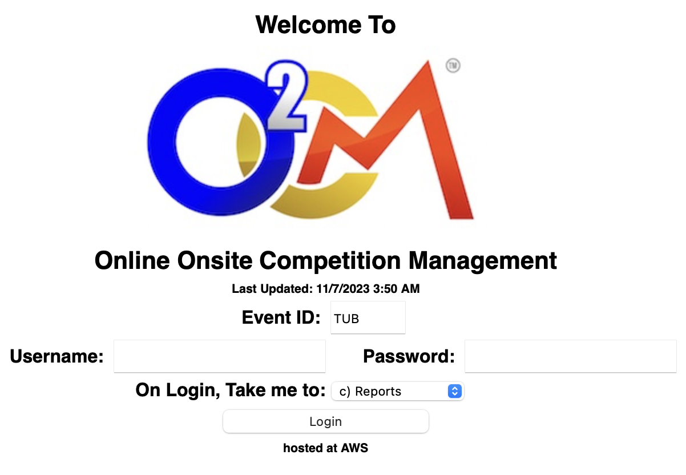
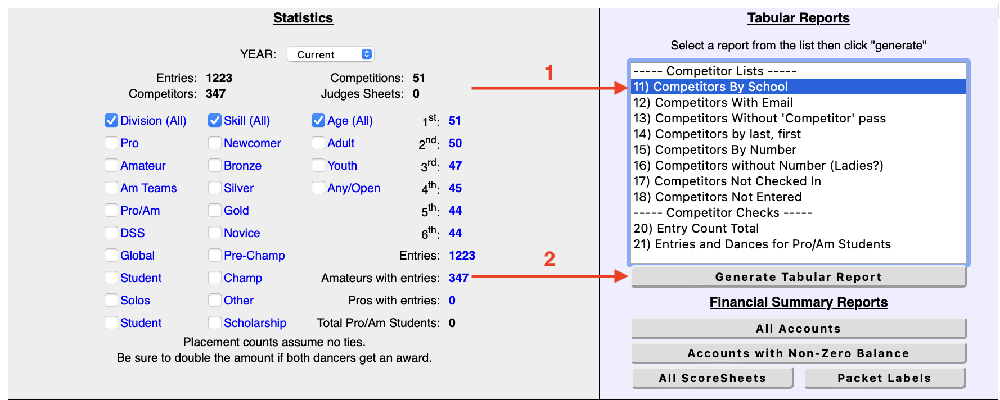
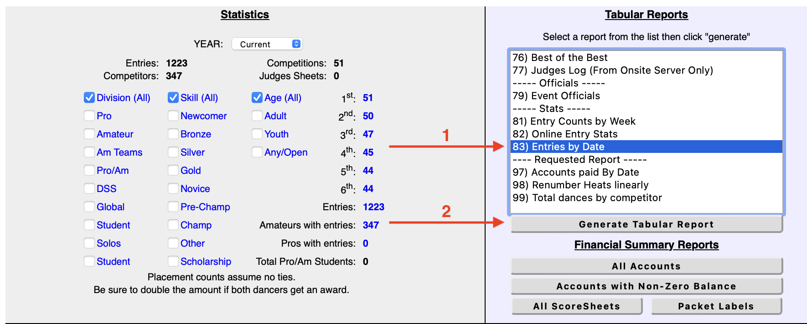
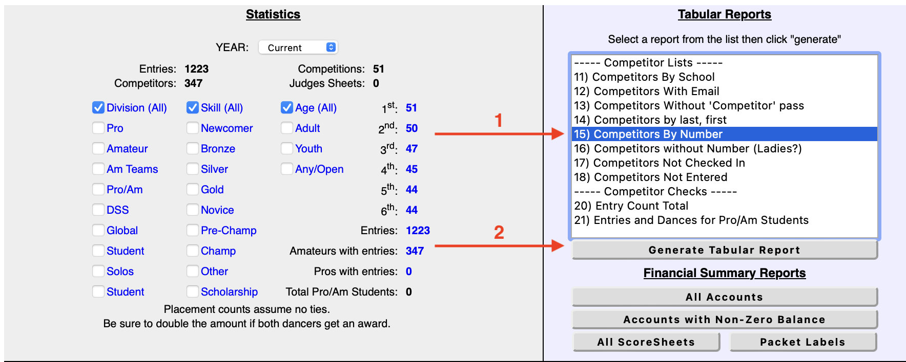

# O2CM Quote Scraper

## Setup

1. Install Python 3 - there's a fine guide on installing it found on the [official wiki](https://wiki.python.org/moin/BeginnersGuide/Download). TLDR: on Mac and Windows download it from [here](https://www.python.org/downloads/); on Linux you must refer to your package manager.

   - All the following commands _may_ need to be run using `python3` instead of just `python`. Make sure that `python --version` prints out some `3.XX` version or use `python3` if not.

2. Create a virtual environment by running `python -m venv env`

   - If you get a `no module named venv` message or similar, google around and get it installed.

3. Activate the virtual environment with `source env/bin/activate` (Linux & Mac) or `env/Scripts/activate.bat` (Windows)
4. Install the required Python packages with `python -m pip install -r requirements.txt`

   - Once again, if you get a `no module named pip` message then google around to see about getting it installed.

5. Follow the instructions under [usage](#usage) to run the script!

## Usage

If you created a virtual environment during setup, make sure to activate it (Linux & Mac: `source env/bin/activate`; Windows: `env/Scripts/activate.bat`) before running the script. _This has to be done any time your terminal is restarted!_

The quickest way to get started is to run the program in "auto" mode. You can do this by running `python registration.py auto` and entering your O2CM event ID and the start date for the report. As I'm sure you'd like more information on what's going on, I implore you to read on!

This program needs a few competitor reports from O2CM to work properly. You can either have them fetched automatically or point it at local files that you've downloaded manually. The two methods are detailed below.

Regardless of the mode used, the script will save all the team quotes to the `target` directory, a list of competitor numbers to `numbers.csv`, and open dancer information to `open_dancers.csv`.

### Automatically Download Reports

You can either run the program in auto mode like so:

```shell
python registration.py auto
```

and it will prompt you for necessary info, or you can provide it upfront like so:

```shell
python registration.py auto --event-id EVENT_ID --after-date YYYY-MM-DD
# example: python registration.py auto --event-id TUB --after-date 2024-09-01
```

The script will then fetch all the required reports, parse and process them, and save the results. The reports it fetched will also be saved as `.html` files in the working directory. Feel free to provide these to the manual mode later if you wish to rerun the program.

### Manually Download Reports

So you wish to forage for your own data! To begin, head over to [the O2CM admin login page](https://admin.o2cm.com) and login. Make sure "Reports" is selected in the "take me to" dropdown.



Once you're logged in, we will need to download three reports. The first is "Competitors By School", the second is "Entries by Date", and the third is "Competitors By Number".







For each, click "Generate Tabular Report" and save the page to the same directory as this program. On Windows do it with `ctrl+s` and on Mac do it with `cmd+s`. On Linux figure it out. The saved filenames can be whatever you want! _At this point, please stand up, stretch, and drink water. You're doing great._

If you haven't already, install the Python dependencies by getting into the terminal, navigating to the program directory, and running `python -m pip install -r requirements.txt`. You may need to use `python3` instead of `python` if your `python` installation defaults to Python 2 or older - you can check by running `python --version`.

Finally run the program with `python registration.py files <by school file> <by date file> <by number file>`.
